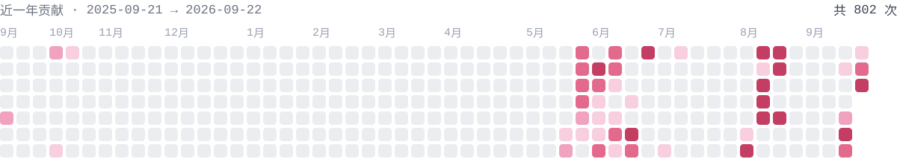

 

  

## 关于

大二在读。写的东西集中在 **Linux 桌面与发行版**这一块 ——
给 KDE Plasma 6 写动态壁纸引擎，给 Arch 写控制中心和登录主题，也在维护一个自己的发行版。

日常在 **QML / Qt Quick**、**Node.js** 和 **Python** 之间来回，绕不开 D-Bus、Wayland 协议和 Arch 打包。
业余做二次元相关的东西：马娘同人项目 [SCE 系列](https://github.com/OracleLoadstar)，我参与核心计算与项目领导。别名 Miprota / Protakarose。

## 在做

- **[MipLinux](https://github.com/MipLinux/MipLinux)** —— 基于 Arch 的发行版。想解决两件具体的事：NVIDIA 驱动开箱可用，中文环境（输入法、字体、国内镜像）开箱可用。
- **[mip-paper](https://github.com/LaT-SKY/mip-paper)** —— KDE Plasma 6 / KWin 6 / Wayland 的动态壁纸引擎，已在 AUR 发布。

## 项目

| 项目 | 说明 | 主要技术 |
| --- | --- | --- |
| [**mip-paper**](https://github.com/LaT-SKY/mip-paper) | 动态壁纸引擎。把壁纸铺到每台显示器的全屏 Canvas 上，加鼠标视差、悬浮信息面板和媒体音频频谱 | Electron · D-Bus · FFT |
| [**MipLinux**](https://github.com/MipLinux/MipLinux) | 基于 Arch 的滚动发行版，正在做安装程序之前的全部部分 | archiso · PKGBUILD |
| [**AITAS**](https://github.com/ShanHuiSir/Teaching-System) | 比赛项目中的实训评价系统。我负责 Magic Bar、类 Niri 式作业审批界面、AI 功能、CI 自动化与服务器维护 | Vue · CI |
| [**SCE 系列**](https://github.com/OracleLoadstar) | 马娘同人项目。我参与核心计算与项目领导 | C++ · Java |
| [**sddm-theme-miprota**](https://github.com/LaT-SKY/sddm-theme-miprota) | Material Design 3 风格的 SDDM 登录主题，多显示器、会话切换、登录失败抖动 | QML · PKGBUILD |
| **Mips** | 桌面管理中心。托盘常驻、D-Bus 单实例、中英切换、更新检查与硬件健康页 —— 当前搁置 | Python · Qt Quick |

## 技术栈

| 方向 | 在用的东西 |
| --- | --- |
| **系统** | Arch Linux · KDE Plasma 6 · KWin 6 · Wayland · SDDM · archiso |
| **语言** | QML / Qt Quick · JavaScript（Node.js / Electron）· Python · C++ · Shell |
| **接口** | D-Bus · StatusNotifierItem · XDG |
| **打包** | PKGBUILD · AUR · pacman · repo manifest |

## 统计

<picture>
  <source media="(prefers-color-scheme: dark)" srcset="./assets/heat-dark.svg">
  
</picture>

<picture>
  <source media="(prefers-color-scheme: dark)" srcset="https://streak-stats.demolab.com/?user=LaT-SKY&background=0D1224&border=1E2540&stroke=1E2540&ring=F5A9C8&fire=EFC77E&currStreakNum=EDEFF7&sideNums=EDEFF7&currStreakLabel=F5A9C8&sideLabels=8892B4&dates=6E7A99&hide_border=true&locale=zh">
  
</picture>

## 联系

- 博客 —— [miprota.cc](https://miprota.cc)
- 邮箱 —— [me@miprota.cc](mailto:me@miprota.cc)
- 组织 —— [OracleLoadstar](https://github.com/OracleLoadstar) · [MipLinux](https://github.com/MipLinux)

Powered by Linux + 兴趣 + 运气

